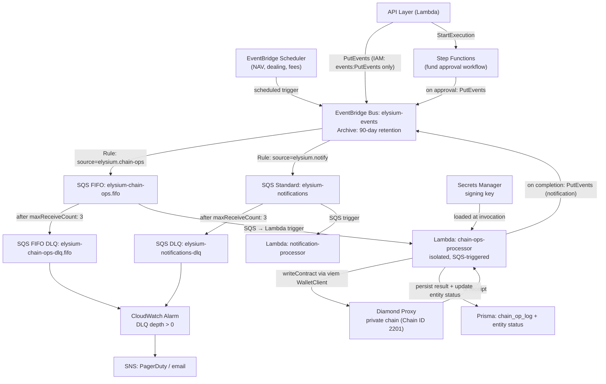

# ADR-004: Message Queue Architecture

> Date: 2026-02-23
> Status: **Superseded** by [Platform Architecture V2](../plans/2026-03-05-elysium-platform-architecture.md)
>
> **What changed:** The SQS FIFO queue approach described here was replaced with direct Step Functions orchestration. The chain-ops Lambda is now invoked as a workflow step within Step Functions, not as an SQS FIFO consumer. The chain-ops Lambda isolation model (dedicated IAM role, ephemeral signing key, ~2-5s residence) remains as described. See Platform Architecture V2, Section 3 (Unified Step Functions) and Section 4 (Blockchain Transaction Safety) for the current design.

---

## Abstract

Elysium's backend cannot reliably submit on-chain transactions from API Lambda handlers — Lambda timeouts, the absence of retry/DLQ semantics, and the need to expose signing keys at the API layer all make inline transaction submission structurally unsound. This ADR establishes a message queue architecture for all async operations: on-chain writes, off-chain notifications, and recurring scheduled tasks.

**Core decision:** All on-chain state-changing operations are routed through an **EventBridge event bus → SQS FIFO queue → isolated Lambda processor**. The chain-ops Lambda holds the chain signing key(s) — loaded from Secrets Manager at invocation, present in memory only for the ~2–5 second execution, then discarded — and is the only service permitted to submit transactions. The API Lambda layer is prohibited from holding or accessing signing keys.

**Off-chain resource creation** uses a **hybrid pattern**: the API creates the DB entity synchronously (with status `PENDING_CHAIN`) and returns `201 Created` immediately, then enqueues the on-chain write. When the chain-ops Lambda confirms the transaction, it updates the entity status to `ACTIVE`. This avoids a `202 Accepted` black-hole UX while keeping the API non-blocking.

**Queue taxonomy:** Four async mechanisms are used, each matched to its workload:
- **SQS FIFO** — on-chain writes (ordered per `fundId`, DLQ with alerting)
- **SQS Standard** — notifications and emails (no ordering needed)
- **EventBridge Scheduler** — recurring/cron operations (NAV automation, dealing cycle triggers, fee crystallization)
- **Step Functions** — multi-step approval workflows with human-in-the-loop wait states (fund approval)

**Message retention:** SQS has a hard 14-day maximum retention limit. The `chain_op_log` Prisma table is the durable fallback — every command is recorded before it is enqueued, enabling re-enqueue from DB if the queue drops a message.

**Queue chaining** is permitted with a maximum 1-hop rule (e.g., a completed chain-ops message may trigger a notification, but not another chain-ops message of the same type). Processors must never publish back to the same queue they consume from.

**Open questions (flagged as TODO):**
- Signing key model (per-role service account vs. per-user) — warrants a dedicated ADR.
- Interaction between EventBridge archive replay and the error correction engine — to be reconciled against the error correction branch.

---

## 1. Problem Statement

Elysium's backend currently uses AWS Lambda handlers to serve API requests. Any on-chain write — posting NAV, processing orders, creating a fund, minting fees — requires submitting a transaction to the Diamond Proxy contract and waiting for confirmation. This creates three structural problems:

1. **No delivery guarantee.** If a Lambda handler crashes after submitting a transaction but before recording the result, the operation is lost with no recovery path. An HTTP request is fire-and-forget; there is no built-in retry, no dead-letter routing, and no alert.

2. **API Lambda is the wrong runtime for blockchain transactions.** Transactions take time to confirm. An API Lambda behind API Gateway has a 29-second timeout — insufficient for chain confirmation. However, a Lambda triggered directly by SQS (no API Gateway) has a 15-minute timeout. On a private chain with a ~2–5 second block time, transaction confirmation fits comfortably within this limit.

3. **The signing key does not belong in the API layer.** If on-chain writes happen directly from API Lambda, the transaction signing key must be accessible to every API handler — a broad exposure surface. The key should only be accessible to a dedicated, isolated processor with its own IAM role.

A message queue solves all three: the API publishes an intent, an isolated chain-ops Lambda holds the signing key and submits the transaction, and the queue guarantees the intent is processed exactly once or escalated to a dead-letter queue (DLQ) with alerting.

This pattern is standard practice in blockchain-adjacent financial systems. It is sometimes called a "command queue" or "outbox pattern," though here the queue is the primary delivery mechanism rather than a database outbox.

---

## 2. Context & Constraints

**Current stack:**
- Backend: AWS Lambda (Serverless Framework, Node.js, `eu-west-1`)
- Blockchain: Private chain (Chain ID 2201), Diamond Proxy contract, `viem` client
- On-chain roles: `ROLE_NAV_UPDATER`, `ROLE_FX_UPDATER` etc. (role-gated write functions)
- Infra: VPC, RDS, Secrets Manager

**On-chain write operations in scope** (exhaustive list derived from smart contract facets):

| Facet | Operations |
|-------|-----------|
| `FundManagementFacet` | `createFund`, `createClass`, `setDealingSchedule`, `setMaxCapacity` |
| `NavManagementFacet` | `updateNav`, `openDealing`, `closeDealing` |
| `FxManagementFacet` | `updateFXRates` |
| `OrderManagementFacet` | `processOrders` |
| `FeeManagementFacet` | `mintFees`, `crystallizeFees` |
| `EligibilityFacet` | `setInvestorEligibility`, `setJurisdictionRules` |
| `AccountFacet` | `createAccount`, `updateAccountFlags` |
| `FundLifecycleFacet` | `setFundStatus`, `setClassStatus`, `forceRedeem` |

On-chain reads (`ViewCallsFacet`, `ViewCalls2Facet`) are `eth_call` operations — no state change, no gas, synchronous. They are **not** queued.

**Constraints:**

- Must remain on AWS infrastructure — no new vendor dependencies.
- The Lambda API layer must not hold or access the chain signing key.
- Operations within a fund must be ordered (e.g., NAV must be posted before `processOrders` for the same dealing window; fund must exist before class creation).
- The system has a sophisticated error correction engine (`ERROR_CORRECTION_ENGINE.md`). Corrections to on-chain state are always new transactions submitted at the chain tip — the queue infrastructure should support operational replay of unprocessed messages (e.g., Lambda errors during a dealing window) via EventBridge archive.
- Notification / email delivery (investor invites, dealing window alerts) also needs delivery guarantees but does not require ordering or chain access.

**Non-Goals:**

- Replacing Prisma transactions with queue messages — off-chain DB writes remain synchronous.
- Queuing on-chain reads — `eth_call` operations remain inline in Lambda handlers.
- Building a full event sourcing system — the queue is for reliable command delivery, not as the primary state store.

---

## 3. Options Considered

### Option A: AWS SQS FIFO — Lambda processor (isolated)

A single SQS FIFO queue (`elysium-chain-ops.fifo`) receives all on-chain write commands. An isolated Lambda function is triggered by the SQS FIFO queue (native integration — no API Gateway, no polling loop). FIFO ordering is enforced per message group (grouped by `fundId`). A DLQ receives messages after `maxReceiveCount` failures; a CloudWatch alarm fires on DLQ depth > 0.

The Lambda has its own IAM role with access only to Secrets Manager (signing key), SQS (receive/delete), and blockchain RPC. The signing key is loaded at invocation and exists in memory only for the ~2–5 second execution. Reserved concurrency of 5 ensures per-message-group ordering while allowing parallel processing across funds.

No native replay — once a message is consumed and deleted, it is gone. Replay for error correction requires a separate Prisma command log (record intent in DB before enqueuing; re-enqueue from DB for replay).

#### Pros

- Simplest topology — one queue, one Lambda function, one DLQ.
- Native SQS FIFO → Lambda integration (no polling loop to build or manage).
- Lowest cost (~$0.50/month vs ~$15–30/month for always-on Fargate).
- SQS FIFO deduplication window (5 minutes) prevents duplicate enqueuing from the API side.
- Shortest signing key residence time — key in memory only during execution (~2–5s), not always-on.
- Scales to zero — no compute cost when no transactions are queued.

#### Cons

- No native replay. Error correction replay requires building a side-channel (Prisma command log + re-enqueue logic).
- All on-chain op types share one queue; a stuck message group for one fund cannot block other funds (FIFO per group), but visibility management requires care.
- Cold start (~1–3s for Node.js) adds latency to first invocation — acceptable for async queue processing.

---

### Option B: EventBridge + SQS FIFO — Lambda processor (isolated)

The API publishes events to an EventBridge custom event bus (`elysium-events`). EventBridge routes events to an SQS FIFO queue via a rule. EventBridge archives all events with configurable retention.

The isolated Lambda function receives from the SQS queue exactly as in Option A — EventBridge is transparent to it. The difference is that the EventBridge archive allows **native replay** of any window of events to any target, without building a separate command log.

#### Pros

- **Native replay**: EventBridge archive retains every event for a configurable period (default: 90 days). Replaying a time range requires a single API call or console action.
- Decouples publishers from the SQS topology — the API publishes events to the bus; routing rules are configured independently of the application code.
- Future fanout is trivial: add a rule to route events to a second target (e.g., audit log, analytics pipeline) without modifying the producer.
- EventBridge archive enables operational recovery: if the chain-ops Lambda encounters persistent errors during a dealing window, unprocessed messages can be replayed to the queue without bespoke re-enqueue logic.
- Cost overhead over Option A is marginal at the transaction volumes expected for a fund admin platform.

#### Cons

- One additional hop (EventBridge → SQS) versus direct SQS publish. Adds ~milliseconds of latency — inconsequential for async operations.
- Two components to monitor (EventBridge + SQS) instead of one.
- EventBridge replay can cause duplicate on-chain transactions if idempotency is not enforced at the processor level. Requires an `operationId` check against a Prisma command log before submitting.

---

### Option C: Amazon MSK (Managed Kafka) — consumer group

Amazon MSK provides full Apache Kafka semantics: topics per operation type, consumer groups, offset-based replay, configurable log retention. A dedicated consumer service runs a Kafka consumer group.

Replay is native and precise — replay from any offset, no separate command log needed, no idempotency gap from EventBridge's event granularity.

#### Pros

- Kafka log is the authoritative command history. Full replay from any offset.
- Consumer groups allow multiple processor types to consume the same events independently (e.g., chain processor + audit logger + reporting pipeline).
- Mature tooling for distributed stream processing.

#### Cons

- Significant operational overhead: MSK cluster provisioning, Kafka topic management, consumer group offset tracking, monitoring (Kafka lag, replication factor, etc.).
- High cost: minimum ~$500/month for a basic MSK cluster versus ~$0 at low volume for SQS.
- Transaction volumes for a fund admin platform are in the hundreds per dealing cycle — Kafka's throughput capacity is several orders of magnitude beyond what is needed.
- Consumer requires a Kafka client library (e.g., `kafkajs`) and bootstrap broker configuration; meaningfully more complex than SQS → Lambda trigger.

---

## 4. Rules: What Goes Through the Queue

The following rules govern which operations must, may, or must not be queued. They apply to all new code from this decision forward.

### Rule 1 — All on-chain writes MUST be enqueued

Any operation that calls a state-changing contract function (consumes gas, modifies chain state) must be submitted via the command queue. It must never be called inline from an API Lambda handler.

**Rationale:** Lambda timeout, tx confirmation latency, signing key isolation, and delivery guarantee. There are no exceptions to this rule.

**Applies to:** Every operation listed in §2's facet table.

---

### Rule 2 — On-chain reads MUST NOT be enqueued

`eth_call` operations (ViewCallsFacet, ViewCalls2Facet, any `view`/`pure` function) are synchronous, stateless, and free. They remain inline in Lambda handlers via the viem public client.

---

### Rule 3 — Operations that must not be silently lost MUST be enqueued

Off-chain operations that have financial, regulatory, or user-experience significance should use the queue if silent failure is unacceptable:

- Investor invite emails
- NAV confirmation / dealing window notifications to investors
- KYC status update propagation (when this triggers an on-chain eligibility update — see Rule 1)
- Fund approval workflow transitions (Elysium ops approving a fund for publication)
- Haruko NAV feed → `updateNav()` pipeline trigger

Notifications with no financial consequence (e.g., marketing emails) may use direct SES/SNS calls without queuing.

---

### Rule 4 — Operations with ordering dependencies MUST use the same FIFO message group

Within a fund, the following ordering invariants must be preserved:

- Fund creation before class creation.
- NAV posting before `processOrders` for the same dealing window.
- `openDealing` before order submission; `closeDealing` before processing.

**Implementation:** All on-chain write commands for the same fund must use `fundId` as the SQS FIFO `MessageGroupId`. This guarantees sequential processing per fund without blocking other funds.

---

### Rule 5 — Every queued command MUST carry an idempotency key

All commands include a stable `operationId` (UUIDv4, generated at publish time). The chain-ops Lambda checks this key against the Prisma `chain_op_log` before submitting a transaction. If the operation is already `COMPLETED`, the message is deleted without re-submission. This prevents duplicate on-chain transactions during SQS redelivery or EventBridge replay.

---

### Rule 6 — Queue chaining is permitted with a maximum 1-hop limit

A processor completing one operation may publish a message to a *different* queue as a downstream effect (e.g., a completed `CREATE_FUND` chain-op triggers a `NOTIFY_FUND_MANAGER` notification message). This is acceptable.

What is not permitted:
- A processor publishing back to the same queue it consumed from (except via SQS's native retry mechanism).
- Unbounded fan-out chains (A → B → C → D with no terminal condition).
- A chain-ops message triggering another chain-ops message of the same operation type (loops).

Any queue chaining beyond 1 hop must be explicitly designed as a named workflow (use Step Functions) rather than implicit processor-to-processor coupling.

---

## 5. Off-chain Processing Patterns

This section covers how async patterns apply to off-chain operations — specifically, what the API response model looks like when an operation has both synchronous (DB) and asynchronous (chain) parts.

### The Hybrid "Pending Entity" Pattern

For operations that create or modify a DB entity **and** require an on-chain write, the recommended pattern is:

1. API validates the request (auth, Cerbos, Zod schema).
2. API creates the DB entity synchronously with `status: PENDING_CHAIN`.
3. API returns `201 Created` with the entity and its stable ID immediately.
4. API enqueues the on-chain write command to EventBridge.
5. Chain-ops Lambda submits the transaction and waits for receipt.
6. On confirmed receipt: entity status → `ACTIVE`.
7. On failure: entity status → `FAILED`; DLQ alert fires.

**Why not `202 Accepted`?** A `202` response implies the entity does not yet exist — the frontend has no ID to poll, and no DB record exists for other systems to reference. The hybrid pattern gives the entity a stable ID and visible pending state immediately.

**Why not fully synchronous?** The API cannot block on chain confirmation — Lambda timeout and UX latency make this impractical.

**Example — fund creation:**

```
POST /funds
  → Validate request
  → Create Fund row (status: PENDING_CHAIN, fundId: uuid)
  → Return 201 { fundId, status: "PENDING_CHAIN" }
  → Enqueue CREATE_FUND to elysium-chain-ops.fifo

[Chain-Ops Lambda — triggered by SQS]
  → Receives CREATE_FUND message
  → Loads signing key from Secrets Manager
  → Calls FundManagementFacet.createFund() on chain
  → On receipt: UPDATE Fund SET status = 'ACTIVE' WHERE fundId = ?
  → On failure: throws error → SQS retries → DLQ alert
```

The frontend polls the Fund entity's `status` field (via GraphQL) to show progress. The entity is always queryable — it exists from the moment the API returns.

**Entity statuses for PENDING_CHAIN entities:**

| Status | Meaning |
|--------|---------|
| `PENDING_CHAIN` | DB record created; on-chain write enqueued but not yet confirmed |
| `ACTIVE` | On-chain write confirmed; entity is live |
| `FAILED` | On-chain write failed after all retries; entity is in error state |
| `PENDING_APPROVAL` | Awaiting Elysium ops approval before on-chain write is enqueued (Step Functions) |

---

### Queue Type Taxonomy

Not all async workloads belong in the same queue. The right mechanism depends on ordering requirements, retention needs, and whether the operation is event-driven or time-driven.

| Mechanism | Use case | Ordering | Max retention | Processor |
|-----------|----------|----------|---------------|-----------|
| **SQS FIFO** | On-chain writes | Per `fundId` | 14 days | Lambda (isolated, SQS trigger) |
| **SQS Standard** | Notifications, emails | None | 14 days | Lambda trigger |
| **EventBridge Scheduler** | Recurring/cron operations | N/A | N/A (scheduled) | Lambda |
| **Step Functions (Express)** | Multi-step approval workflows | N/A | 90 days | Managed runtime |
| **SQS Delay Queue** | Time-delayed retries | None | 14 days | As needed (V2+) |

**EventBridge Scheduler** (not to be confused with the event bus) is the right tool for recurring operations:
- NAV automation trigger (daily at dealing cut-off time)
- Dealing window open/close (per fund schedule)
- Fee crystallization trigger (monthly/quarterly per class)

These replace cron jobs entirely and are managed, observable, and retryable without a polling loop.

**Step Functions** is the right tool for the fund approval workflow:
- Fund created with `status: PENDING_APPROVAL`
- Step Functions state machine waits for an Elysium ops approval action (human-in-the-loop)
- On approval: transitions to `PENDING_CHAIN`, enqueues `CREATE_FUND` to chain-ops queue
- On rejection: transitions to `REJECTED`, notifies the manager

Step Functions is **not** a queue — it is a durable state machine. It is the correct abstraction when a workflow has branching, human approval steps, or multi-stage transitions that cannot be modelled as a single queue message.

**SQS Delay Queue** (V2+): messages become invisible for 0–15 minutes after enqueue. Useful for retry-with-backoff patterns. Not needed at V1 — SQS's native visibility timeout handles retry.

---

### SQS Message Retention

SQS has a **hard maximum retention of 14 days**. Messages that are not consumed within 14 days are permanently deleted by AWS with no recovery path.

This means:
- If the chain-ops Lambda is failing for more than 14 days (highly unlikely — DLQ catches failures within 3 retries), messages are lost.
- The `chain_op_log` Prisma table is the durable safety net. Every command is written to `chain_op_log` (status: `PENDING`) before the EventBridge event is published. If SQS drops a message, the record still exists in the DB and can be re-enqueued.
- A background sweep (Lambda on EventBridge Scheduler, daily) should detect `chain_op_log` records in `PENDING` or `IN_PROGRESS` state older than a configurable threshold (e.g., 1 hour) and alert on-call. These represent commands that were enqueued but never processed — candidates for manual re-enqueue or investigation.

---

### Number of Processors

**Rule: one processor per queue type.** Do not share a Lambda function across multiple queues.

| Queue | Processor | IAM scope |
|-------|-----------|-----------|
| `elysium-chain-ops.fifo` | Lambda (isolated, SQS trigger) | SQS receive/delete + Secrets Manager (signing keys) + blockchain RPC |
| `elysium-notifications` | Lambda (SQS trigger) | SQS receive/delete + SES send |
| EventBridge Scheduler targets | Lambda (per schedule) | Minimal — per operation |
| Step Functions workflows | Step Functions runtime | Managed |

Each processor has the minimum IAM permissions for its job. The chain-ops Lambda is the only service with access to signing keys. Notification Lambda has no chain access.

**Isolation model for chain-ops Lambda:**
- **No API Gateway** — triggered exclusively by SQS FIFO (native integration) or Step Functions
- **Dedicated IAM role** — `secretsmanager:GetSecretValue` for `/${stage}/chain/signing-key` only, `sqs:ReceiveMessage/DeleteMessage` for the chain-ops queue only, network access to blockchain RPC only
- **Reserved concurrency: 5** — prevents runaway invocations, ensures per-message-group ordering via SQS FIFO semantics
- **Key residence: ~2–5 seconds** — signing key loaded from Secrets Manager at invocation, used for transaction signing, discarded when Lambda execution completes. No always-in-memory exposure.

Scaling: FIFO queues process one message per message group at a time by design, so increasing Lambda concurrency does not increase per-fund throughput — it only allows parallel processing across funds with independent message groups. Reserved concurrency of 5 handles the expected fund count at V1.

---

## 6. Architecture

### Queue Topology



---

### Message Envelope

All events published to EventBridge share a common envelope:

```json
{
  "source": "elysium.chain-ops",
  "detailType": "PROCESS_ORDERS | POST_NAV | UPDATE_FX | CREATE_FUND | ...",
  "detail": {
    "operationId": "uuidv4",
    "fundId": "string",
    "requestedBy": "userId",
    "requestedAt": "ISO8601",
    "payload": {}
  }
}
```

The `operationId` is used as:
- SQS FIFO `MessageDeduplicationId` (prevents duplicate enqueuing within 5-minute window)
- Prisma `chain_op_log` primary key (idempotency check before chain submission)

The `fundId` is used as the SQS FIFO `MessageGroupId` (enforces per-fund ordering).

---

### Prisma: `chain_op_log`

A table recording the lifecycle of every queued command:

| Field | Type | Notes |
|-------|------|-------|
| `operationId` | UUID PK | From message envelope |
| `operationType` | String | Enum of operation types |
| `fundId` | String | FK into fund hierarchy |
| `requestedBy` | String | Principal who triggered the operation |
| `status` | Enum | `PENDING` / `IN_PROGRESS` / `COMPLETED` / `FAILED` |
| `txHash` | String? | Chain tx hash once submitted |
| `errorMessage` | String? | Populated on failure |
| `createdAt` | DateTime | When the command was enqueued |
| `completedAt` | DateTime? | When the tx was confirmed |

This table serves three purposes: idempotency checking, audit trail, and a queryable command history for the GraphQL layer (frontend polling for operation status). It is also the durable fallback if SQS drops a message within the 14-day retention window.

---

### Chain-Ops Lambda Processor Flow

Per message received from `elysium-chain-ops.fifo` (via SQS → Lambda trigger):

1. **Load signing key** — read from Secrets Manager (cached across warm invocations via Lambda execution context).
2. **Deserialise and validate** the message envelope.
3. **Check idempotency** — query `chain_op_log` by `operationId`. If `COMPLETED`, return success (SQS deletes message automatically on successful Lambda return).
4. **Mark `IN_PROGRESS`** — upsert `chain_op_log` row.
5. **Build transaction** — construct viem `writeContract` call from `operationType` + `payload`.
6. **Submit** — call `WalletClient.writeContract()`. Record `txHash` in `chain_op_log`.
7. **Wait for receipt** — poll for tx receipt (default timeout: 120s). On a private chain with a ~2–5s block time, confirmation is predictable. If polling exceeds the timeout, throw an error to trigger SQS retry — do not resubmit the same transaction.
8. **Record result** — on confirmed receipt: status → `COMPLETED`, set `completedAt`, update any linked entity status (e.g., Fund → `ACTIVE`). On error: status → `FAILED`, set `errorMessage`, update entity status.
9. **Publish downstream event** — if operation type has a downstream notification (e.g., `CREATE_FUND` → notify fund manager), publish a single `elysium.notify` event to EventBridge (1-hop rule).
10. **Return** — successful return causes SQS to delete the message automatically. Thrown error causes SQS to retry up to `maxReceiveCount`, then routes to DLQ.

---

### Replay via EventBridge Archive

> **TODO:** The interaction between EventBridge archive replay and the error correction engine needs to be reconciled against the error correction branch before this section is finalised. The blockchain is append-only — on-chain corrections are new transactions at the chain tip, not replays of historical commands. EventBridge replay is an operational recovery tool for unprocessed queue messages (e.g., Lambda errors during a dealing window), not a mechanism for correcting chain state. See `ERROR_CORRECTION_ENGINE.md` for the authoritative model.

1. Identify the time range of unprocessed events (cross-reference with `chain_op_log` for `FAILED` or missing records).
2. Replay to a **staging** SQS queue by default to verify behaviour before touching production.
3. For production replay: the idempotency check (step 2 of the processor flow) silently skips any `operationId` already in `COMPLETED` state, ensuring only genuinely unprocessed operations are submitted.

---

## 7. Decision

> We are adopting **EventBridge + SQS FIFO** as the command queue, with an **isolated Lambda processor** (no API Gateway, dedicated IAM role, SQS-triggered) as the consumer for on-chain writes.
>
> Off-chain resource creation uses the **hybrid pending entity pattern** — DB entity created synchronously with `PENDING_CHAIN` status; on-chain write is async via the queue.
>
> Recurring operations use **EventBridge Scheduler**. Multi-step approval workflows use **Step Functions**.
>
> The API Lambda layer is prohibited from holding the chain signing key or submitting transactions directly. The chain-ops Lambda is a separate function with its own IAM role — it cannot be invoked via HTTP.

---

## 8. Rationale

**Why a queue at all:** An HTTP request handler is not a reliable actor for on-chain transactions. Lambda timeout, unpredictable confirmation latency, and no retry/DLQ semantics make inline transaction submission fragile. Every delivery failure is a silent loss. The queue pattern is the standard solution in production blockchain systems for exactly this class of problem.

**Why the hybrid pattern over `202 Accepted`:** A `202` response leaves the frontend with no entity ID and no DB record to poll. The hybrid pattern gives the user an immediately-queryable entity in a visible pending state, while keeping the API non-blocking. It also decouples DB-level consistency (synchronous) from chain-level consistency (async).

**Why EventBridge over plain SQS:** EventBridge archive provides native operational replay — if the chain-ops Lambda encounters persistent errors during a batch of messages, those events can be replayed to the queue without building bespoke re-enqueue logic. Future fanout (audit pipeline, analytics, reporting) is a routing rule change, not a code change. At the transaction volumes expected for a fund admin platform, the marginal cost over plain SQS is negligible.

**Why an isolated Lambda (not Fargate):** The original concern was Lambda's 29-second API Gateway timeout. However, the chain-ops Lambda is triggered by SQS — not API Gateway — giving it a 15-minute timeout. On a private chain with ~2–5s block time, transaction confirmation fits comfortably within this limit. Lambda offers three advantages over Fargate: (1) **shorter key residence** — the signing key is in memory only during the ~2–5s execution, not always-on; (2) **simpler** — no ECS cluster, task definitions, health checks, or polling loop; (3) **cheaper** — scales to zero at ~$0.50/month vs ~$15–30/month for always-on Fargate. The isolation model is equivalent: dedicated IAM role, no HTTP surface, access only to signing key + SQS + blockchain RPC.

**Why SQS FIFO over MSK:** Transaction volumes for a fund admin platform are in the hundreds per dealing cycle — not the millions per second Kafka is designed for. MSK adds ~$500+/month in base cost, consumer group management, offset tracking, and a Kafka client library dependency, providing no benefit that EventBridge archive does not already cover. MSK is the documented upgrade path if multi-consumer topologies or very high throughput become requirements.

**Why the signing key must not be in the API layer:** The API Lambda is a broad-surface HTTP handler. If it holds the signing key, a compromised Lambda or an authorization bug could allow arbitrary on-chain transactions. The chain-ops Lambda is a narrow-surface, SQS-triggered function with a dedicated IAM role and a single job — it cannot be invoked via HTTP. The key's blast radius is dramatically smaller, and its residence time is minimal (~2–5s per invocation).

---

## 9. Risks & Mitigations

- **Risk:** A message is processed but `DeleteMessage` fails, causing SQS to redeliver and the operation to appear to be retried.

  **Mitigation:** Idempotency check at step 2 of the processor flow. An `operationId` in `COMPLETED` state causes the redelivered message to be silently deleted without re-submission.

- **Risk:** A transaction is submitted but receipt polling times out (e.g., the private chain node is temporarily unavailable). Status → `FAILED`; SQS retries; the tx may already be mined by the time the retry runs, resulting in a duplicate submission.

  **Mitigation:** Before resubmitting, the processor checks whether the original `txHash` has since been confirmed by querying the chain directly. If the tx is already mined, update status to `COMPLETED` and delete the message — no new transaction submitted. The private chain has no mempool congestion risk, so a timeout indicates a node issue rather than gas underpricing.

- **Risk:** SQS drops a message after the 14-day maximum retention window.

  **Mitigation:** Every command is written to `chain_op_log` (status: `PENDING`) before the EventBridge event is published. A daily background sweep (EventBridge Scheduler → Lambda) detects stale `PENDING`/`IN_PROGRESS` records older than a threshold and alerts on-call. These can be re-enqueued manually from the DB record.

- **Risk:** DLQ messages are not actioned promptly, causing investor operations to miss a dealing window deadline.

  **Mitigation:** DLQ alarm severity is `CRITICAL` for `chain-ops`. Operations SLA: DLQ messages must be triaged within X minutes during business hours.

- **Risk:** EventBridge replay to production triggers re-execution of already-completed operations.

  **Mitigation:** Default replay target is staging. If production replay is required, the idempotency check prevents re-submission of `COMPLETED` operations. Only `FAILED` or `PENDING` operations are re-attempted.

- **Risk:** Chain-ops Lambda throttling or errors cause a backlog of queued operations that were time-sensitive (e.g., a dealing window cut-off).

  **Mitigation:** Reserved concurrency set to 5 (prevents throttling from account-wide limits). CloudWatch alarm on queue depth growth rate and Lambda error rate. SQS message visibility timeout set to processing time + buffer. Lambda auto-scales within reserved concurrency — no manual restart needed. If persistent errors occur, DLQ catches them within 3 retries.

- **Risk:** Signing key for one on-chain role is compromised via the chain-ops Lambda.

  **Mitigation:** Each on-chain role (`ROLE_NAV_UPDATER`, `ROLE_FX_UPDATER`, etc.) uses an independent key stored separately in Secrets Manager. A compromised key for one role cannot trigger operations outside that role's contract-level permissions. The Lambda's key residence time is minimal (~2–5s per invocation), reducing the window of exposure compared to an always-on processor.

  > **TODO:** The signing key model (per-role service account vs. per-user) has not been formally decided and warrants a dedicated ADR. This section assumes a per-role service account model where the chain-ops Lambda loads system-level keys from Secrets Manager at invocation. If the model is per-user signing, signing would need to happen before enqueue or via a delegated signing service.

---

## 10. Impact

- **Teams:** Backend engineering (chain-ops Lambda processor, EventBridge rules, `chain_op_log` Prisma schema, entity status fields, Lambda publish helpers). DevOps (EventBridge bus + Scheduler, SQS queues, DLQs, CloudWatch alarms, Lambda function + IAM role, Step Functions state machine). On-call rotation (DLQ alerting SLA).
- **Systems:** All Lambda handlers that currently call `writeContract` directly must be refactored to publish to EventBridge instead. The viem `WalletClient` moves exclusively to the chain-ops Lambda; API Lambda handlers retain only the `PublicClient` for reads. Entity models (Fund, ShareClass, etc.) gain a `status` field.
- **Users:** On-chain write operations are asynchronous from the user's perspective. The API returns `201 Created` with an entity in `PENDING_CHAIN` status. The frontend polls entity status via GraphQL for completion.

---

## 11. Success Criteria

- No API Lambda handler holds a viem WalletClient or chain signing key.
- The chain-ops Lambda has a dedicated IAM role with no HTTP trigger (SQS-only).
- All on-chain write operations return `201 Created` with a `PENDING_CHAIN` entity; confirmation updates entity to `ACTIVE` and is visible via GraphQL.
- A DLQ message triggers a CloudWatch alarm within 60 seconds.
- An EventBridge archive replay of a 24-hour window to a staging queue processes all events; idempotency check prevents re-submission of already-`COMPLETED` operations.
- Chain-ops Lambda error rate < 1% over any rolling 7-day period.
- 100% of enqueued commands have a corresponding `chain_op_log` record written before the EventBridge event is published.
- Daily background sweep detects and alerts on any `chain_op_log` record in `PENDING` state older than 1 hour.

---

## 12. Revisit Conditions

- **Transaction volume exceeds ~10,000/day** — evaluate MSK for throughput and multi-consumer topologies.
- **Multiple independent consumers are needed** (e.g., separate compliance audit stream, reporting pipeline) — EventBridge fanout to multiple SQS targets or MSK consumer groups.
- **Chain finality times increase significantly** — if average confirmation exceeds Lambda's 15-minute timeout (e.g., moving to a public chain), evaluate Step Functions with wait-for-callback for the receipt step, or a Fargate long-running processor.
- **EventBridge archive replay proves insufficient for operational recovery** (e.g., archive retention window too short, or replay granularity inadequate) — promote `chain_op_log` re-enqueue as the primary recovery mechanism; retain EventBridge archive for audit only.
- **A new on-chain role requires a separate signing key** — update Lambda's Secrets Manager access policy and key loading logic; verify principle of least privilege per role.
- **Fund approval workflow complexity increases** (e.g., multi-level approval, regulatory sign-off) — expand the Step Functions state machine definition.

---

## 13. References

- [ADR-002: Authorization Architecture](002-authorization-architecture.md) — Cerbos principal must be validated before publishing to EventBridge; authorization gates the queue entry point, not the processor.
- [ADR-003: Management Company Tenancy](003-database-silo.md) — `chain_op_log` should carry `managementCompanyId` (via `fundId` → `umbrellaFundId` FK) for tenant-scoped audit queries.
- [Error Correction Engine](../claude_context/technical/ERROR_CORRECTION_ENGINE.md) — On-chain corrections are new tip transactions computed by this engine and enqueued as normal commands; not related to EventBridge replay.
- [Manager App Product Spec — §3.4 Order Processing](../product_specs/manager-app.md) — Order processing pipeline; this ADR formalises the broader async pattern with isolated Lambda processors.
- [AWS EventBridge Archive and Replay](https://docs.aws.amazon.com/eventbridge/latest/userguide/eb-archive.html)
- [AWS SQS FIFO Queues](https://docs.aws.amazon.com/AWSSimpleQueueService/latest/SQSDeveloperGuide/FIFO-queues.html)
- [AWS EventBridge Scheduler](https://docs.aws.amazon.com/scheduler/latest/UserGuide/what-is-scheduler.html)
- [AWS Step Functions](https://docs.aws.amazon.com/step-functions/latest/dg/welcome.html)
