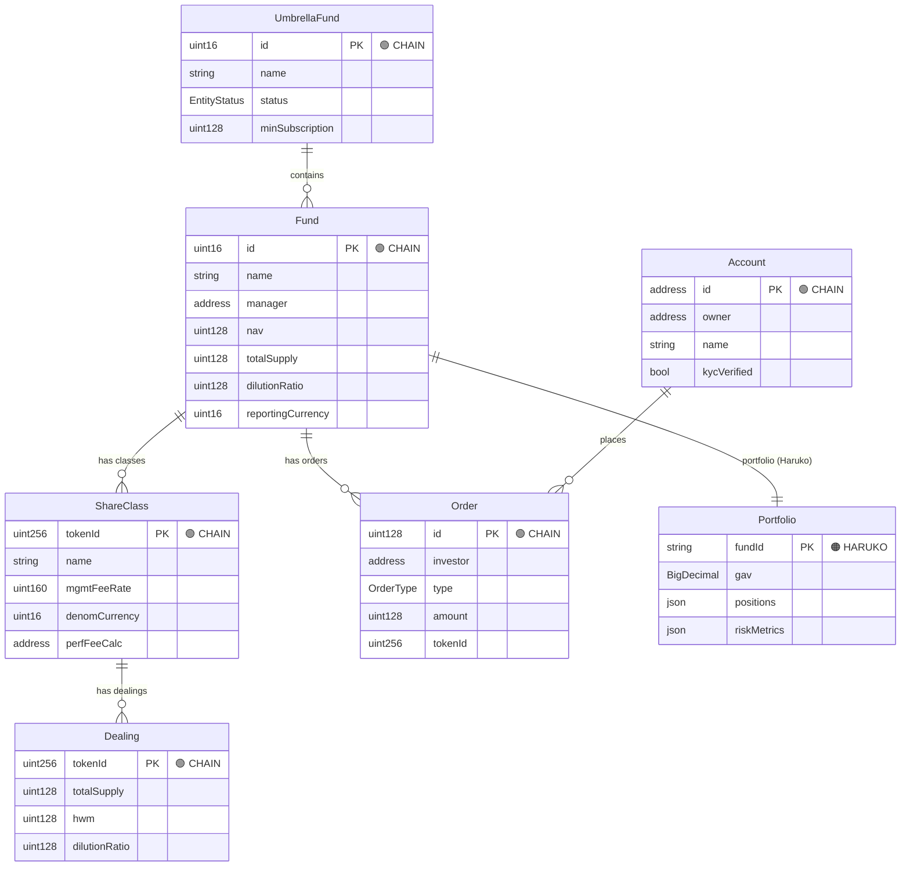
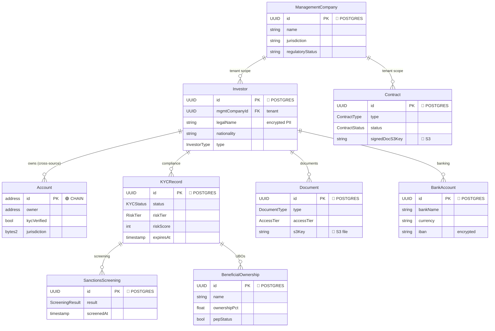
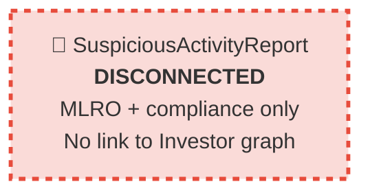
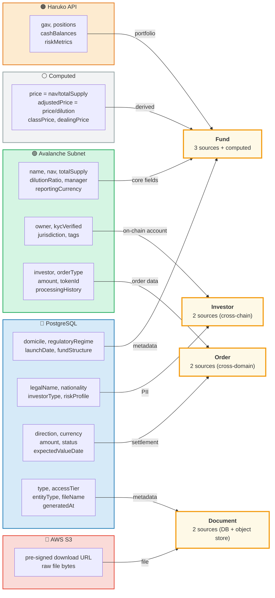
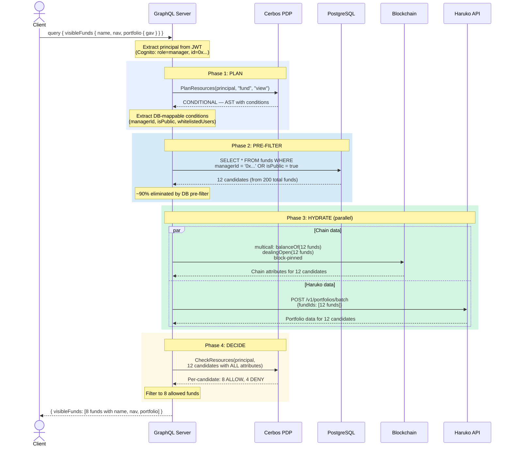
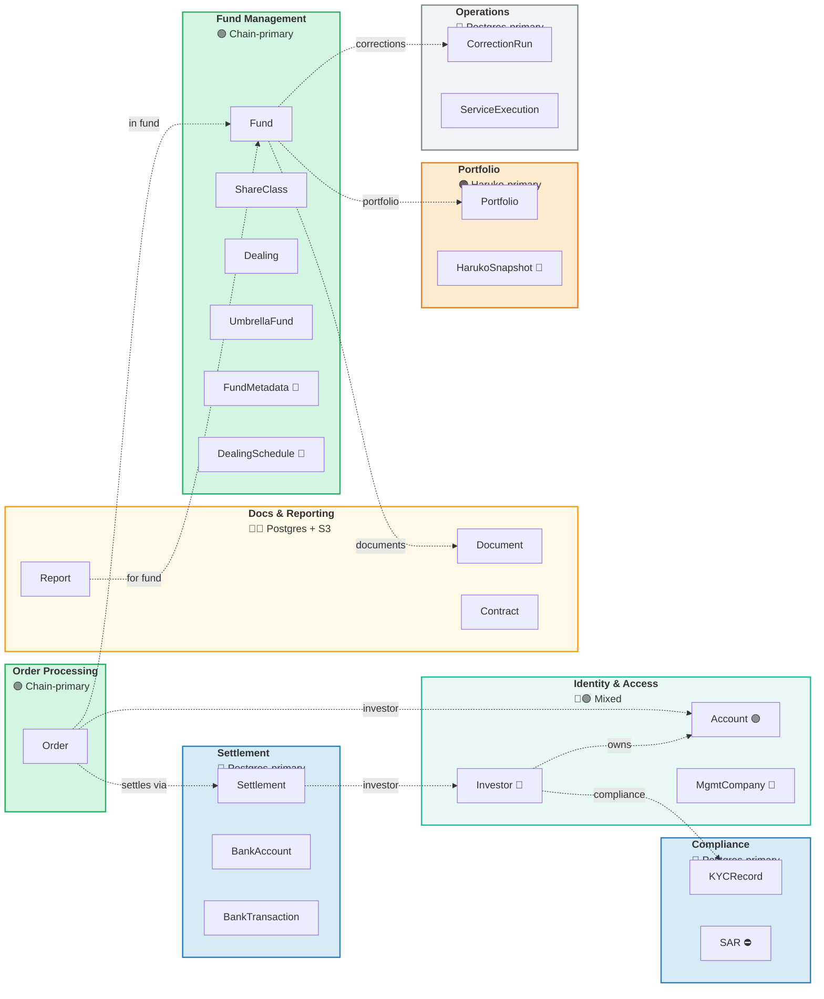
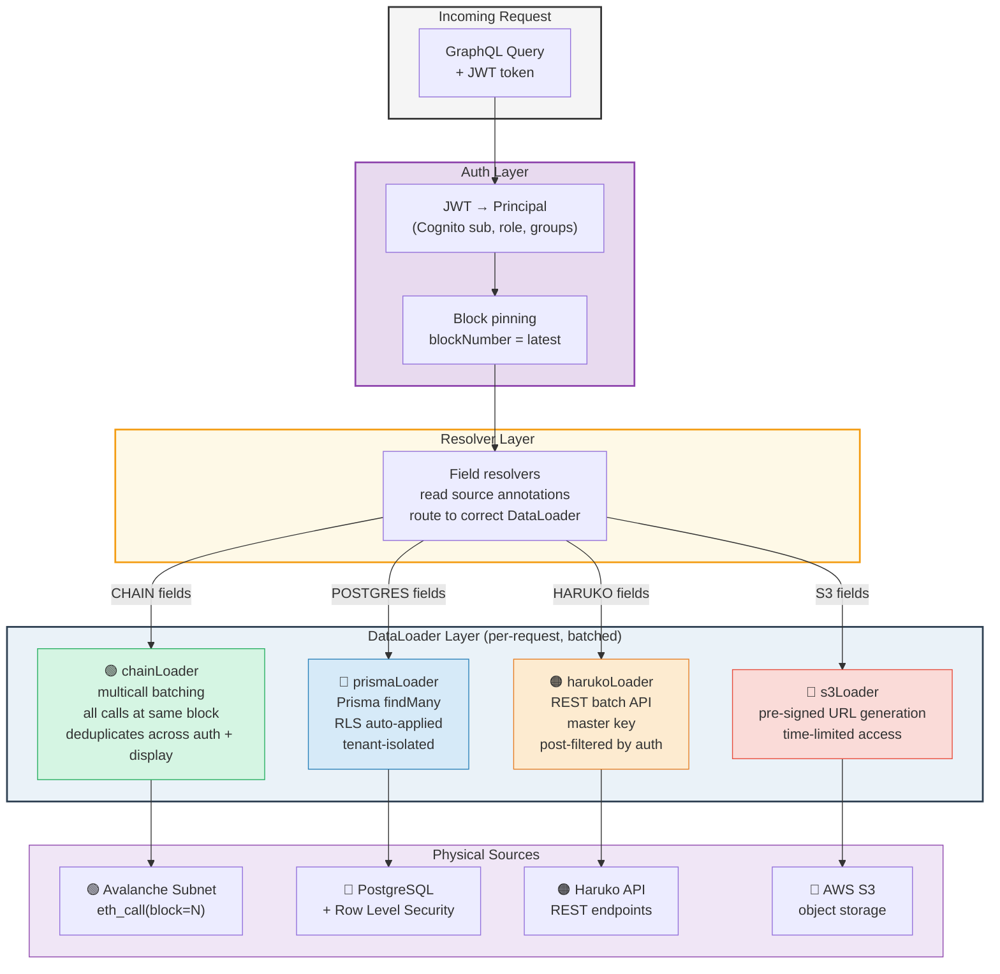

# Unified Data Model — Visual Guide

> Six focused diagrams, each answering one question about the Elysium architecture.
> All diagrams render natively in GitHub and VS Code (Mermaid).
>
> **Story flow:** Domain Structure (1-2) → Cross-Source Architecture (3) → Authorization (4) → Implementation (5-6)
>
> Companion to: [Unified_Data_Model.md](./Unified_Data_Model.md) · [Data_Model_v2.md](./Data_Model_v2.md) · [Authorization_System_V1.md](./Authorization_System_V1.md)

---

## Color Legend (consistent across all diagrams)

| Color | Source | Example |
|-------|--------|---------|
| 🟢 Green | **Avalanche Subnet** (on-chain smart contracts) | Fund, Order, Token balances |
| 🔵 Blue | **PostgreSQL** (off-chain structured data) | Investor PII, KYC, Reports |
| 🟠 Orange | **Haruko API** (portfolio management) | Positions, Risk, Shadow NAV |
| 🔴 Red/Pink | **AWS S3** (document storage) | PDFs, reports, raw API responses |
| 🟣 Purple | **AWS Cognito/KMS** (auth & secrets) | JWT, signing keys |
| ⚪ Grey | **Computed** (derived at query time) | Prices, portfolio values |

---

## Part I: Domain Structure

### Diagram 1 — Fund Domain

> **Question answered:** *What is the core fund accounting data structure?*

The fund hierarchy is entirely on-chain. This is the business model — everything else serves it.

**Key insight:** The entire fund hierarchy (Umbrella → Fund → Class → Dealing) lives on-chain and is queryable at any historical block via `eth_call`. Portfolio data comes from Haruko — the only cross-source link in this domain.

---

### Diagram 2 — Investor & Compliance Domain

> **Question answered:** *What is the investor identity, compliance, and tenant structure?*

This domain is primarily off-chain (PostgreSQL). The bridge to the Fund Domain is through `Account`, which lives on-chain.

**Key insight:** The `Account` entity (green/CHAIN) bridges the two domains — it's on-chain but linked to an off-chain `Investor`. SAR is deliberately disconnected from the Investor graph to prevent tipping-off (Criminal Justice Act / BVI AML).

---

## Part II: Cross-Source Architecture

### Diagram 3 — Entity Source Resolution

> **Question answered:** *How does one logical entity unify data from multiple physical sources?*

Four representative entities showing every source pattern in the system. The domain model entity is in the center; colored arrows show where each field comes from.

**Key insight:** The client queries a unified `Fund` entity. The resolver knows (from source annotations) that `name` comes from chain, `domicile` from Postgres, `gav` from Haruko, and `price` is computed. DataLoaders batch and cache these calls. The client never sees the split.

**These four patterns cover ALL entities in the system:**

| Pattern | Example | Sources |
|---------|---------|---------|
| Multi-source aggregate | Fund | CHAIN + POSTGRES + HARUKO + COMPUTED |
| Cross-source identity bridge | Investor ↔ Account | POSTGRES ↔ CHAIN |
| Cross-domain join | Order → Settlement | CHAIN → POSTGRES |
| Metadata + object store | Document | POSTGRES + S3 |

Every other entity follows one of these four patterns.

---

## Part III: Authorization

### Diagram 4a — Derived Role Hierarchy

> **Question answered:** *How does a generic "manager" become authorized for THIS specific fund?*

```mermaid
graph TB
    subgraph BASE["Cognito Base Roles"]
        admin["admin"]
        manager["manager"]
        investor["investor"]
    end

    subgraph DB_ROLES["Derived Roles — resolved in Phase 2 (DB pre-filter)"]
        fund_mgr["<b>fund_manager</b><br/>managerId == P.id"]
        umbrella_mgr["<b>umbrella_manager</b><br/>umbrellaId match"]
        whitelisted["<b>whitelisted_investor</b><br/>whitelistedUserIds ∋ P.id"]
        order_owner["<b>order_owner</b><br/>accountId == P.accountId"]
        doc_grantee["<b>document_grantee</b><br/>granteeIds ∋ P.id"]
        tenant["<b>tenant_member</b><br/>mgmtCompanyId match"]
        kyc_reviewer["<b>kyc_reviewer</b><br/>permission flag"]
        mlro["<b>mlro</b><br/>permission flag"]
    end

    subgraph CHAIN_ROLES["Derived Roles — resolved in Phase 3-4 (chain hydration)"]
        token_holder["<b>token_holder</b><br/>holderBalance > 0<br/>⚡ requires blockchain call"]
    end

    subgraph ALWAYS["Always-On"]
        platform_admin["<b>platform_admin</b><br/>all access"]
    end

    admin --> platform_admin
    admin --> tenant
    manager --> fund_mgr
    manager --> umbrella_mgr
    manager --> kyc_reviewer
    manager --> mlro
    manager --> tenant
    investor --> token_holder
    investor --> whitelisted
    investor --> order_owner
    investor --> doc_grantee
    investor --> tenant

    style BASE fill:#e8daef,stroke:#8e44ad,stroke-width:2px
    style DB_ROLES fill:#d6eaf8,stroke:#2980b9,stroke-width:2px
    style CHAIN_ROLES fill:#d5f5e3,stroke:#27ae60,stroke-width:2px
    style ALWAYS fill:#fef9e7,stroke:#f39c12,stroke-width:2px
```

**Key insight:** Most derived roles use DB conditions (blue) — these become Prisma WHERE clauses that pre-filter 90% of candidates. Only `token_holder` (green) requires a blockchain call, which happens in Phase 3 for the surviving 10%.

---

### Diagram 4b — 4-Phase Authorization Flow

> **Question answered:** *What happens at runtime when a user queries data?*

---

## Part IV: Implementation Guide

### Diagram 5 — Bounded Context Map

> **Question answered:** *How do we organize the codebase? What are the natural service boundaries?*

Each module is color-coded by primary data source. Dotted lines show cross-context dependencies.

**V1: Modular monolith** — all 8 modules in one GraphQL server. Each module has its own resolvers, DataLoaders, and Cerbos policies.

**Future:** Any module can become an Apollo Federation subgraph by adding `@key` and `__resolveReference`. The dotted cross-context lines become federation entity references.

---

### Diagram 6 — Resolver Pipeline

> **Question answered:** *What is the runtime data-fetching architecture from request to response?*

**Key properties:**
- **Block pinning:** All chain reads use the same block → atomic snapshot per request
- **Cache sharing:** Auth hydration (Phase 3) and display resolvers share the same DataLoader instances → no duplicate fetches
- **Tenant isolation:** PostgreSQL RLS enforces `management_company_id` filtering automatically
- **Source transparency:** Resolvers don't know (or care) about physical sources — they call `ctx.loaders.{source}.{entity}.load(id)`

---

## Quick Reference

### Entity Source Matrix

| Entity | 🟢 Chain | 🔵 Postgres | 🟠 Haruko | 🔴 S3 | Cerbos Resource |
|--------|:--------:|:-----------:|:---------:|:-----:|:---------------:|
| **Fund** | **primary** | metadata | — | — | `fund` |
| **ShareClass** | **primary** | — | — | — | `share_class` |
| **Dealing** | **primary** | — | — | — | *(child)* |
| **UmbrellaFund** | **primary** | — | — | — | `umbrella_fund` |
| **Order** | **primary** | settlement | — | — | `order` |
| **Account** | **primary** | investor link | — | — | `account` |
| **Investor** | — | **primary** | — | — | `investor` |
| **Portfolio** | — | snapshots | **primary** | — | `portfolio` |
| **Document** | — | **metadata** | — | **files** | `document` |
| **KYCRecord** | — | **primary** | — | docs | `kyc_record` |
| **SAR** | — | **primary** | — | — | `sar` |
| **Report** | — | **primary** | — | generated | `report` |
| **Settlement** | — | **primary** | — | — | `settlement` |
| **Contract** | — | **primary** | — | signed | `contract` |
| **CorrectionRun** | — | **primary** | — | — | `correction_run` |
| **MgmtCompany** | — | **primary** | — | — | `mgmt_company` |

### Aggregate Root Decision

| Is it an aggregate root? | Test | Examples |
|--------------------------|------|----------|
| **Yes** — independently fetchable by ID | Can a client query this by ID without knowing its parent? | Fund, Investor, Order, Document |
| **No** — always accessed via parent | Does this entity only make sense in context of its parent? | Dealing (→ShareClass), Position (→Portfolio), FeeMint (→ShareClass) |
| **Disconnected** — no graph traversal path | Must this entity be unreachable from certain graph paths? | SAR (no link to Investor) |
