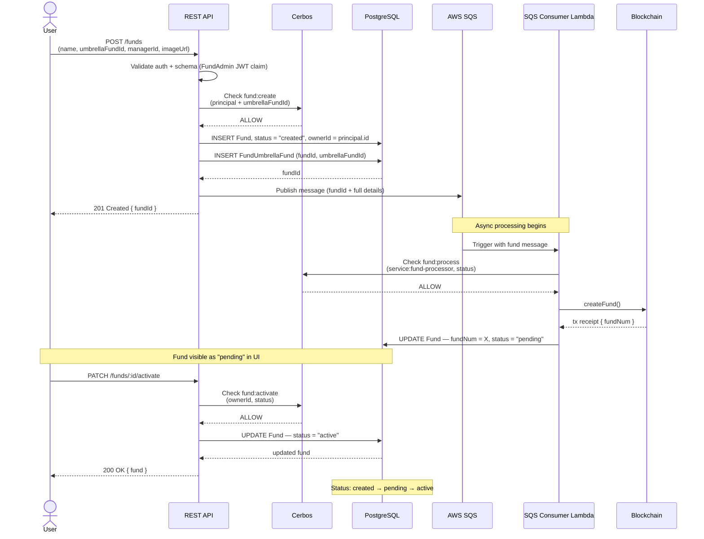

# Fund Creation Flow

## Steps

1. User fills out fund creation form (name, umbrella fund ID, manager ID, imageUrl)
2. Frontend POSTs to API (`POST /funds`)
3. API validates request (auth + Zod schema). Caller must have `FundAdmin` JWT claim.
4. API performs Cerbos authorization check (`fund:create`) — verifies the FundAdmin is assigned to the requested `umbrellaFundId`
5. API writes `Fund` record to PostgreSQL with `status = "created"` and `ownerId` set to the authenticated user
6. API creates join record in `FundUmbrellaFund` linking the new fund to the umbrella fund
7. API publishes fund details to AWS SQS queue
8. API returns `201 Created { fundId }` to frontend
9. SQS Lambda consumer (`fund-processor` service account) picks up the message
10. Lambda performs Cerbos authorization check (`fund:process`) — verifies fund `status == "created"`
11. Lambda calls smart contract `createFund()` on-chain
12. Blockchain assigns `fundNum` (returned in transaction receipt)
13. Lambda updates `Fund` record — sets `fundNum` and `status = "pending"`
14. Frontend displays fund in "pending" state
15. FundAdmin (owner only) activates the fund via frontend (`PATCH /funds/:id/activate`)
16. API performs Cerbos authorization check (`fund:activate`) — verifies `ownerId == principal.id` and `status == "pending"`
17. API updates `Fund` status to `"active"` in PostgreSQL

---

## Data Model

### Tables

| Table | Key Fields |
|---|---|
| `User` | `id`, `privyId`, `email`, `walletAddress` |
| `UmbrellaFund` | `id`, `name` |
| `Fund` | `id`, `name`, `ownerId`, `managerId`, `imageUrl`, `fundNum`, `status` |
| `FundUmbrellaFund` | `fundId`, `umbrellaFundId` (composite PK join table) |

### Fund Status Transitions

```
created  →  pending  →  active
  (API)     (Lambda)   (FundAdmin)
```

---

## Authorization (Cerbos)

| Endpoint | Action | Policy Condition |
|---|---|---|
| `POST /funds` | `fund:create` | FundAdmin role + `assignedUmbrellaFundIds` contains requested `umbrellaFundId` |
| `PATCH /funds/:id/activate` | `fund:activate` | FundAdmin role + `ownerId == principal.id` + `status == "pending"` |
| `GET /funds/:id` | `fund:read` | FundAdmin (any) or Manager (`managerId == principal.id`) |
| SQS Lambda internal update | `fund:process` | `service:fund-processor` role + `status == "created"` |

Policy files: `cerbos/policies/`

---

## Sequence Diagram


